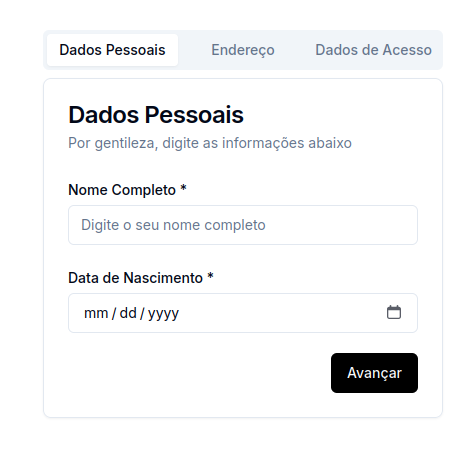
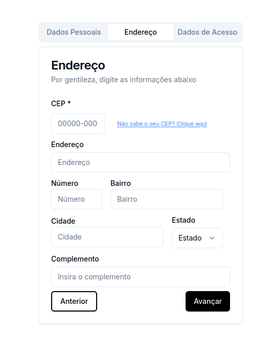
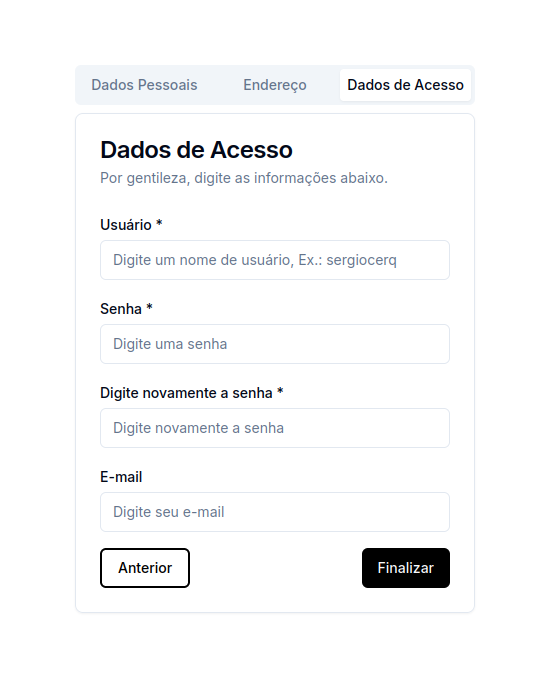

## Cadastro Usuário - Shadcn/UI


O projeto foi desenvolvido utilizando Next.js, focando em uma experiência de usuário eficiente e intuitiva (UI/UX) integrando-o à biblioteca Shadcn UI. O sistema implementa um formulário com múltiplas etapas e validação de campos, garantindo usabilidade otimizada e fluidez no preenchimento das informações. Além disso, foram aplicados princípios modernos de design responsivo e acessibilidade.

# Dados pessoais


# Endereço


# Dados de acesso


## Instruções de instalação 

Inicialmente, clone o repositório do projeto:
```
git clone https://github.com/sergiocerq/Form-DadosPessoais.git
```

Após isso, entre na pasta da aplicação:

```
cd shadcn-ui
```

Em seguida instale as dependências do projeto:
```
npm install
```

Por fim, utilize o seguinte comando para iniciar a aplicação:
```
npm run dev
```
E abra, em seu navegador de preferência, o seguinte link:

<a href="http://localhost:3000"/>